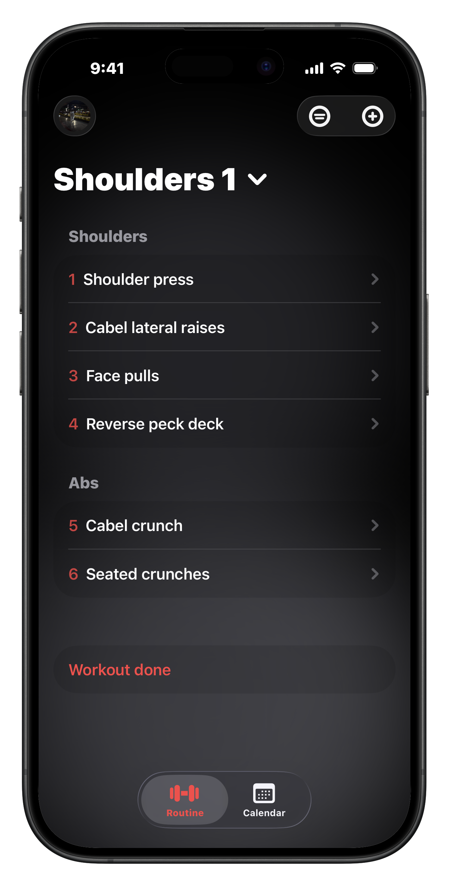
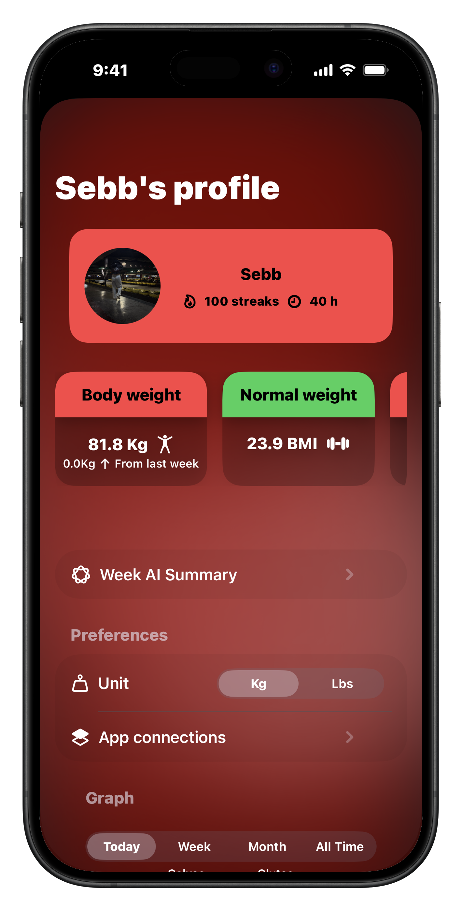
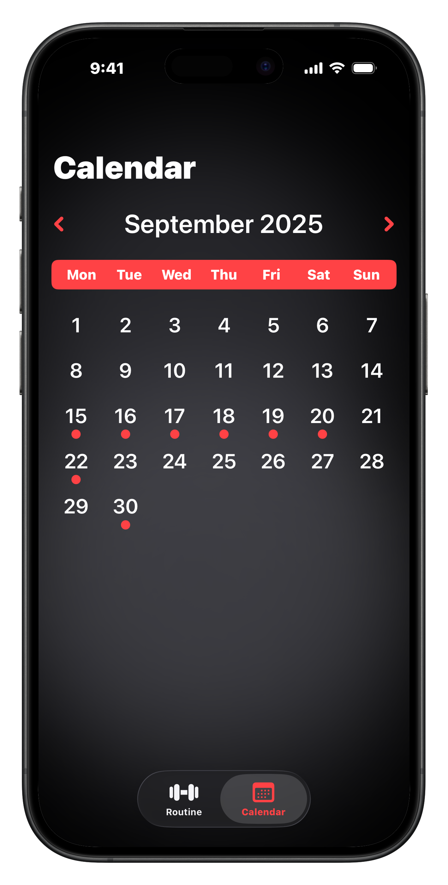
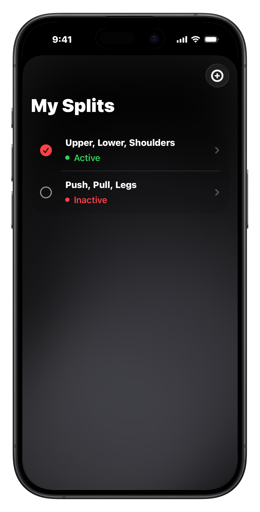
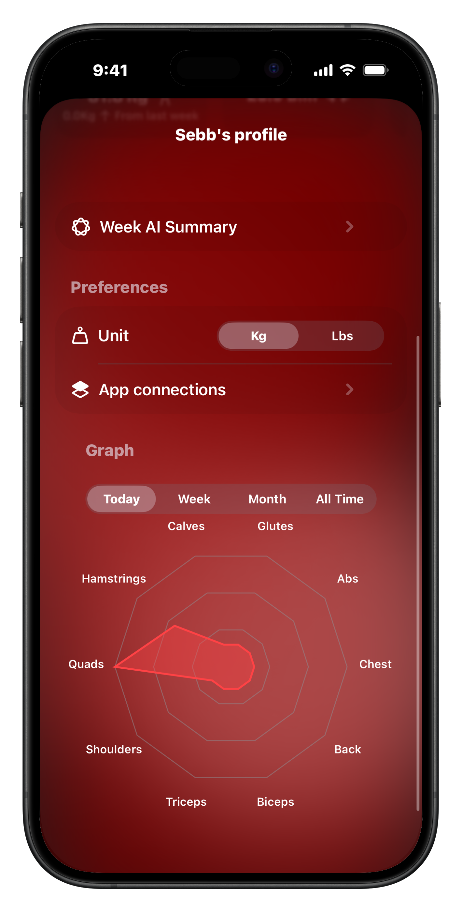
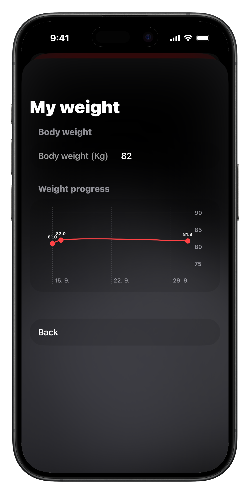
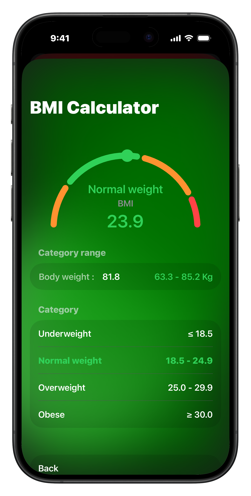
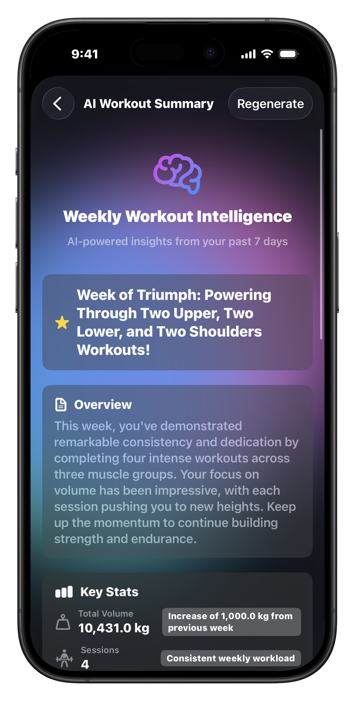

# 🏗️ Gymly Architecture Documentation

## Overview

Gymly is built using modern iOS development practices with SwiftUI and SwiftData, following an MVVM architecture pattern. This document provides a detailed overview of the app's architecture, data flow, and key design decisions.

## Technology Stack

- **Language:** Swift 5.9+
- **UI Framework:** SwiftUI
- **Data Persistence:** SwiftData (iOS 17+)
- **Additional Storage:** UserDefaults, FileManager
- **APIs:** HealthKit, AuthenticationServices
- **Architecture Pattern:** MVVM + ObservableObject
- **Minimum Target:** iOS 17.0+

## App Architecture

### High-Level Architecture

```
┌─────────────────────────────────────────────────────────┐
│                    SwiftUI Views                         │
│  (TodayWorkoutView, CalendarView, SettingsView, etc.)   │
└────────────────────┬────────────────────────────────────┘
                     │
                     │ Data Binding
                     ▼
┌─────────────────────────────────────────────────────────┐
│              WorkoutViewModel (MVVM)                     │
│  • Business Logic                                        │
│  • State Management                                      │
│  • Data Coordination                                     │
└────────────┬────────────────────────┬────────────────────┘
             │                        │
             ▼                        ▼
┌────────────────────┐    ┌──────────────────────────────┐
│   SwiftData        │    │   External Services          │
│   Models           │    │  • HealthKit                 │
│  • Exercise        │    │  • AuthenticationServices    │
│  • Day             │    │  • FileManager               │
│  • Split           │    │  • UserDefaults              │
│  • DayStorage      │    │                              │
└────────────────────┘    └──────────────────────────────┘
```

## Core Data Models

### 1. Exercise Model

The fundamental unit of a workout, representing a single exercise with its sets and metadata.

```swift
@Model class Exercise {
    var id: UUID
    var name: String
    var sets: [Set]
    var repGoal: String
    var muscleGroup: String
    var createdAt: Date
    var completedAt: Date?
    var exerciseOrder: Int
    var done: Bool
}
```

**Responsibilities:**
- Track exercise metadata (name, muscle group, rep goals)
- Manage exercise sets
- Track completion status
- Maintain exercise ordering within a day

### 2. Set Model

Represents a single set within an exercise with detailed tracking capabilities.

```swift
@Model class Set {
    var weight: Double/Int
    var reps: Int
    var failure: Bool        // Set taken to failure
    var warmUp: Bool         // Warm-up set
    var restPause: Bool      // Rest-pause set
    var dropSet: Bool        // Drop set
    var time: String         // Time for the set
    var note: String         // Exercise notes
    var bodyWeight: Bool     // Body weight exercise
}
```

**Set Types:**
- **Standard Set** - Regular working set
- **Warm-up Set** - Preparatory set with lighter weight
- **Failure Set** - Set taken to muscular failure
- **Drop Set** - High-intensity technique
- **Rest-Pause Set** - Advanced intensity technique

### 3. Day Model

Represents a single workout day containing multiple exercises.

```swift
@Model class Day {
    var id: UUID
    var name: String
    var exercises: [Exercise]
    var dayOrder: Int
}
```

### 4. Split Model

Collection of workout days forming a complete training routine.

```swift
@Model class Split {
    var id: UUID
    var name: String
    var days: [Day]
    var isActive: Bool
}
```

### 5. DayStorage Model

Calendar-based storage for completed workouts with date tracking.

```swift
@Model class DayStorage {
    var date: Date
    var day: Day
    var workoutDuration: TimeInterval
}
```

## App Navigation Structure

The app uses a tab-based navigation system with 5 main sections:

1. **Today's Workout** - Current day training interface
2. **Calendar** - Workout history and planning
3. **Connections** - Social features (future)
4. **Splits** - Workout split management
5. **Settings** - User preferences and configuration



## Key Components

### WorkoutViewModel

The central business logic component managing:

- **Workout State Management**
  - Current workout tracking
  - Exercise progression
  - Set completion logic

- **Data Persistence**
  - SwiftData operations
  - Calendar storage
  - Split management

- **HealthKit Integration**
  - Weight synchronization
  - BMI calculations
  - Workout data export

### Config (Configuration Manager)

Global configuration and user preferences:

```swift
@Observable class Config {
    // User Preferences
    var weightUnit: WeightUnit  // kg or lbs
    var theme: Theme            // light/dark

    // HealthKit Settings
    var healthKitEnabled: Bool
    var autoSyncWeight: Bool

    // User Profile
    var userName: String
    var profileImage: Data?
}
```



### Calendar Integration

The calendar system provides visual workout history:

- **DayStorage** - Maps dates to completed workouts
- **Visual Indicators** - Shows workout completion status
- **Historical Data** - Access past workout data
- **Progress Tracking** - Monitor consistency over time



## Data Flow

### 1. Workout Execution Flow

```
User Opens App
    ↓
Load Active Split → WorkoutViewModel
    ↓
Display Today's Day → TodayWorkoutView
    ↓
User Logs Sets → Update Exercise Model
    ↓
Complete Exercise → Mark as Done
    ↓
Finish Workout → Save to DayStorage
    ↓
Sync to HealthKit → Export Workout Data
```

### 2. Data Persistence Flow

```
User Action (Add/Edit/Delete)
    ↓
WorkoutViewModel receives change
    ↓
Update SwiftData Models
    ↓
SwiftData Auto-saves to Disk
    ↓
UI Updates via @Observable/@State
```

### 3. HealthKit Integration Flow

```
User Enables HealthKit
    ↓
Request Permissions
    ↓
Sync Weight/BMI/Height ← HealthKit
    ↓
User Completes Workout
    ↓
Export Workout Data → HealthKit
```

## Feature Modules

### Split Management

**Import/Export System:**
- Custom `.gymlysplit` file format
- JSON-based serialization
- Share via FileManager



### Progress Analytics

**Muscle Group Tracking:**
- 10 predefined muscle groups
- Radar chart visualization
- Volume and frequency tracking



### Weight & BMI Tracking

**HealthKit Integration:**
- Automatic weight syncing
- BMI calculation and visualization
- Historical tracking




### AI Workout Summary

**Smart Analysis:**
- Workout pattern recognition
- Performance insights
- Progress recommendations



## Storage Strategy

### SwiftData (Primary)
- Exercise data
- Workout history
- Splits and days
- Calendar storage

**Advantages:**
- Type-safe
- Automatic persistence
- Query optimization
- Relationship management

### UserDefaults (Preferences)
- User settings
- App configuration
- Weight unit preference
- Last active split

### FileManager (Files)
- Profile images
- Split exports (.gymlysplit)
- Temporary data

### HealthKit (Health Data)
- Weight measurements
- BMI readings
- Height data
- Workout sessions

## Performance Considerations

### Data Loading
- Lazy loading for exercise lists
- Pagination for calendar views
- Efficient SwiftData queries

### Memory Management
- Proper use of @State and @Observable
- Avoid retain cycles in closures
- Release unused exercise data

### UI Responsiveness
- Async/await for heavy operations
- Main thread reserved for UI updates
- Background processing for HealthKit sync

## Security & Privacy

### Data Protection
- Local-only storage (SwiftData)
- Encrypted HealthKit data
- Secure Apple Sign In

### Permissions
- HealthKit read/write access
- Photo library access (profile pictures)
- No network permissions required (offline-first)

## Extensibility

### Adding New Features

1. **New Exercise Type**
   - Extend Exercise model
   - Update ExerciseDetailView
   - Add muscle group if needed

2. **New Analytics**
   - Create visualization component
   - Query SwiftData for metrics
   - Add to analytics view

3. **New Export Format**
   - Implement Codable conformance
   - Add FileManager export logic
   - Update share sheet

## Testing Strategy

### Unit Tests
- Model validation
- Business logic (WorkoutViewModel)
- Data transformation utilities

### UI Tests
- Critical user flows
- Navigation testing
- Data entry validation

### Integration Tests
- HealthKit sync
- Data persistence
- Import/export functionality

## Future Architecture Considerations

### Planned Improvements

1. **Cloud Sync** (iCloud)
   - Multi-device synchronization
   - Conflict resolution
   - CloudKit integration

2. **Modular Architecture**
   - Feature-based modules
   - Dependency injection
   - Better testability

3. **Performance Optimization**
   - Core Data migration strategy
   - Improved caching layer
   - Optimized query patterns

---

**Last Updated:** October 2025
**Version:** 1.0
**Author:** Sebastián Kučera
