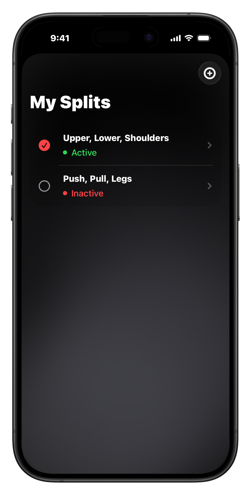
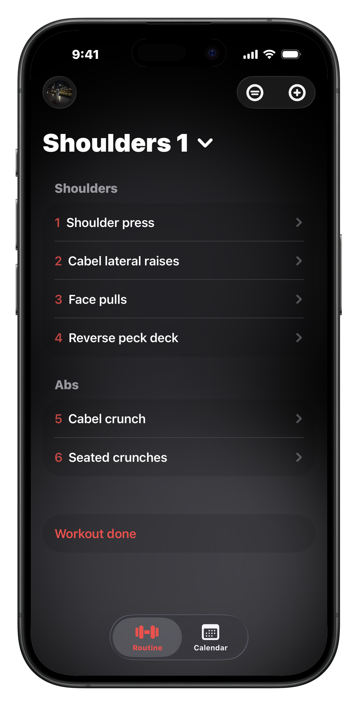
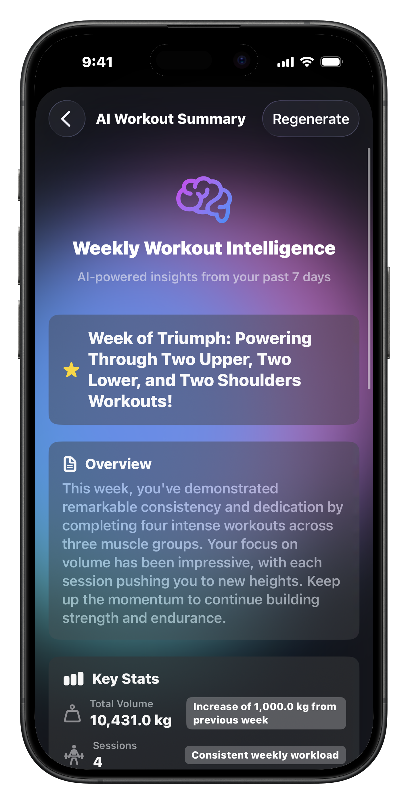
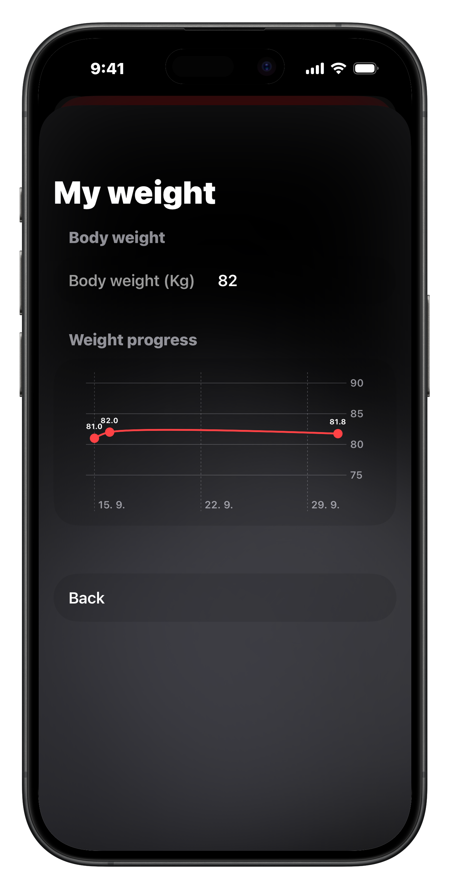

# 📱 Gymly User Guide

Welcome to Gymly! This comprehensive guide will help you get started and make the most of your fitness tracking experience.

## Table of Contents

1. [Getting Started](#getting-started)
2. [Setting Up Your Profile](#setting-up-your-profile)
3. [Creating Your First Workout Split](#creating-your-first-workout-split)
4. [Logging Your Workouts](#logging-your-workouts)
5. [Tracking Progress](#tracking-progress)
6. [Using the Calendar](#using-the-calendar)
7. [HealthKit Integration](#healthkit-integration)
8. [Advanced Features](#advanced-features)

---

## Getting Started

### First Launch

When you first open Gymly, you'll be greeted with a clean, intuitive interface. The app is designed to be easy to use while providing powerful tracking capabilities.

### Navigation

Gymly uses a bottom tab bar for easy navigation between main sections:

1. **Today** - Your current workout
2. **Calendar** - View workout history
3. **Connections** - Social features (coming soon)
4. **Splits** - Manage workout routines
5. **Settings** - Configure preferences

---

## Setting Up Your Profile

### Accessing Settings

Tap the **Settings** tab at the bottom right to configure your profile and preferences.

### Profile Configuration

1. **Add Profile Picture**
   - Tap on the profile image placeholder
   - Choose a photo from your library
   - Your picture will be saved locally

2. **Edit Your Name**
   - Tap on your name field
   - Enter your preferred display name
   - Changes save automatically

3. **Body Metrics**
   - Enter your current weight
   - Add your height for BMI tracking
   - Enable HealthKit sync for automatic updates

### HealthKit Setup

Enable HealthKit integration to sync your weight, BMI, and workout data:

1. Navigate to Settings
2. Toggle "Enable HealthKit"
3. Grant necessary permissions when prompted
4. Your health data will sync automatically

---

## Creating Your First Workout Split

### What is a Split?

A workout split is your training routine divided across multiple days. Common examples include:
- **Push/Pull/Legs** (3-day split)
- **Upper/Lower** (2-day split)
- **Bro Split** (5-6 day split)

### Creating a New Split

1. Tap the **Splits** tab
2. Tap **"+ New Split"**
3. Name your split (e.g., "PPL Week 1")
4. Add workout days

### Adding Workout Days

1. Within your split, tap **"+ Add Day"**
2. Name the day (e.g., "Push Day", "Leg Day")
3. Add exercises to each day
4. Configure sets, reps, and weight for each exercise

### Selecting Muscle Groups

For each exercise, select the primary muscle group:

- **Upper Body:** Chest, Back, Shoulders, Biceps, Triceps
- **Lower Body:** Quads, Hamstrings, Calves, Glutes
- **Core:** Abs

This helps with progress tracking and muscle group analytics.

---

## Logging Your Workouts

### Starting a Workout

1. Open the **Today** tab
2. Your current day's workout will be displayed
3. Tap on an exercise to begin

### Logging Sets

For each exercise:

1. **Enter Weight**
   - Tap the weight field
   - Enter the weight used
   - Switch between kg/lbs in settings

2. **Enter Reps**
   - Tap the reps field
   - Log the number of repetitions completed

3. **Mark Set Type** (optional)
   - **Warm-up** - Light preparatory sets
   - **Failure** - Sets taken to muscular failure
   - **Drop Set** - Reduce weight and continue
   - **Rest-Pause** - Brief rest within a set

4. **Add Notes** (optional)
   - Tap the notes field
   - Add form cues, feelings, or reminders

### Completing Exercises

- Mark exercises as complete by tapping the checkmark
- The app tracks your total workout time automatically
- Progress automatically when you finish all exercises

### Workout Summary

After completing your workout:

- View total workout duration
- See AI-generated workout insights
- Review performance metrics
- HealthKit automatically syncs your workout

---

## Tracking Progress

### Muscle Group Analytics

View detailed analytics showing which muscle groups you're training:

1. Navigate to the **Progress** section
2. View the muscle group radar chart
3. See workout frequency per muscle group
4. Identify areas that need more attention

### Weight Tracking

Monitor your body weight changes over time:

1. Log weights manually in Settings
2. Or enable HealthKit for automatic sync
3. View your weight progression graph
4. Track trends over weeks and months

### BMI Monitoring

Track your Body Mass Index:

1. Enter height and weight in Settings
2. View BMI with visual gauge indicator
3. Monitor changes over time
4. Categories: Underweight, Normal, Overweight, Obese

---

## Using the Calendar

### Viewing Workout History

The calendar provides a complete overview of your training history:

1. Tap the **Calendar** tab
2. Browse by month
3. Days with workouts are highlighted
4. Tap any day to view that workout's details

### Calendar Features

- **Color-coded Days** - Visual indicators for workout completion
- **Workout Details** - Tap any completed day to see exercises and sets
- **Streak Tracking** - Monitor consistency
- **Historical Data** - Access all past workouts

---

## HealthKit Integration

### Syncing Health Data

Gymly integrates seamlessly with Apple Health:

**Data Synced FROM HealthKit:**
- Body weight
- Height
- BMI

**Data Synced TO HealthKit:**
- Workout sessions
- Exercise duration
- Calories burned (estimated)

### Enabling Sync

1. Go to **Settings**
2. Enable **"HealthKit Integration"**
3. Grant permissions when prompted
4. Data syncs automatically in the background

### Manual Sync

If needed, you can manually trigger a sync:
1. Navigate to Settings
2. Tap **"Sync HealthKit Data"**
3. Wait for confirmation

---

## Advanced Features

### Set Types

**Warm-up Sets**
- Prepare muscles and joints
- Use lighter weight
- Higher reps (12-20)

**Failure Sets**
- Push to muscular failure
- Last set of an exercise
- Maximize hypertrophy

**Drop Sets**
- Reduce weight immediately after failure
- Continue to failure again
- Advanced intensity technique

**Rest-Pause Sets**
- Take brief rest (10-15 seconds)
- Continue the same set
- Accumulate more volume

### Exercise Notes

Add detailed notes to sets:
- Form reminders
- How the set felt
- Equipment variations
- Personal records

### Import/Export Splits

**Exporting:**
1. Go to Splits
2. Long-press on a split
3. Tap **"Export Split"**
4. Share via Messages, Email, etc.

**Importing:**
1. Receive a `.gymlysplit` file
2. Tap to open
3. Gymly imports automatically
4. New split appears in your splits list

### Unit Conversion

Switch between metric and imperial:

1. Go to **Settings**
2. Tap **"Weight Unit"**
3. Choose **kg** or **lbs**
4. All weights convert automatically

---

## Tips & Best Practices

### For Best Results

1. **Consistency is Key**
   - Log every workout
   - Track all sets honestly
   - Review progress weekly

2. **Use Set Types Wisely**
   - Warm-up on heavy compounds
   - Take final sets to failure
   - Don't overuse intensity techniques

3. **Track Progressive Overload**
   - Gradually increase weight
   - Add reps when possible
   - Monitor volume over time

4. **Leverage Analytics**
   - Check muscle group balance
   - Ensure adequate frequency
   - Adjust split if needed

5. **Stay Organized**
   - Name exercises clearly
   - Keep splits updated
   - Archive old routines

### Common Questions

**Q: Can I edit a completed workout?**
A: Yes, tap on the workout in the calendar to view and edit it.

**Q: How do I delete a set?**
A: Swipe left on the set and tap delete.

**Q: Can I copy exercises between days?**
A: Yes, long-press an exercise and select "Copy to Day".

**Q: Does the app work offline?**
A: Yes! Gymly works completely offline. HealthKit sync happens when online.

**Q: How is workout time calculated?**
A: The timer starts when you begin your first set and stops when you mark the workout complete.

---

## Troubleshooting

### HealthKit Not Syncing

1. Check HealthKit permissions in iOS Settings
2. Ensure HealthKit is enabled in Gymly Settings
3. Try manual sync
4. Restart the app

### Missing Workouts in Calendar

1. Ensure you completed the workout
2. Check if the workout was saved
3. Try refreshing the calendar view

### App Performance Issues

1. Close and restart the app
2. Ensure you're on the latest version
3. Check available storage on device
4. Contact support if issues persist

---

## Getting Help

### Support Channels

- **Discord:** rektoooooo
- **Email:** sebastian.kucera@icloud.com
- **Instagram:** [@seb.kuc](https://www.instagram.com/seb.kuc/)

### Feature Requests

Have an idea for Gymly? Reach out via email with:
- Feature description
- Use case
- Why it would be valuable

---

## What's Next?

### Upcoming Features

- **Cloud Sync** - Access workouts across devices
- **Apple Watch App** - Log sets from your wrist
- **Social Features** - Share progress with friends
- **Exercise Library** - Pre-built exercise database
- **Rest Timer** - Automatic rest period tracking

---

**Happy Training! 💪**

*Built with ❤️ by Sebastián Kučera*
